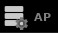

# TTYD-Key-Item-Tracker
A Poptracker pack that can track items and locations for the Paper Mario: The Thousand Year Door Randomizer by jamesbrq, supporting auto-tracking use with [Archipelago](https://archipelago.gg/).

This pack supports multiple styles and layouts.

Please report anything strange to the [discord](https://discord.gg/mkBVUyN8q8), or to me, ZobeePlays!

## Location Color Key

| Color  | Meaning                                                                                                                               |
|--------|---------------------------------------------------------------------------------------------------------------------------------------|
| Red    | This check is not currently accessible.                                                                                               |
| Yellow | This check is not logically accessible, but the location can be reached through alternate methods (e.g. glitches, breaking key logic) |
| Green  | All checks at this location are logically accessible.                                                                                 |
| Blue   | The check at this location is visible, but you cannot currently access the check.                                                     |

## Installation / Launching guide:
1. This will require the Poptracker software to run. The website for it can be found  [here](https://poptracker.github.io/) with the most current release found [here](https://github.com/black-sliver/PopTracker/releases).  
***Note:*** Once PopTracker is downloaded, it will have a `packs` folder that PopTracker packs are placed within.    
2. Download the latest release for the TTYD PopTracker pack from the [releases page](https://github.com/ZobeePlays/TTYD-Randomizer-AP-Tracker/releases).
3. Place the downloaded `.zip` file into the packs folder called in in step 1.
4. Open your PopTracker application and click on the *Load Pack* button in the top left.
5. Select the *TTYD Key Item Tracker* and then choose what layout you'd like to use.

## Useful buttons to know about

 
The above two icons can often be useful while using the pack.
- The left icon is the *Open Pack Settings* button which lets you tweak various settings relating to how PopTracker interprets whether you can access certain checks or not. If you're using auto-tracking, most of these settings get filled in for you. If you're not, you'll want to match the settings you filled in your YAML when you generated your game.
- The right icon is the *AP* button which allows you to connect to an in progress Archipelago session. You'll be prompted for the Archipelago Host/Port information, the slot name from your YAML, and the password if one was made.